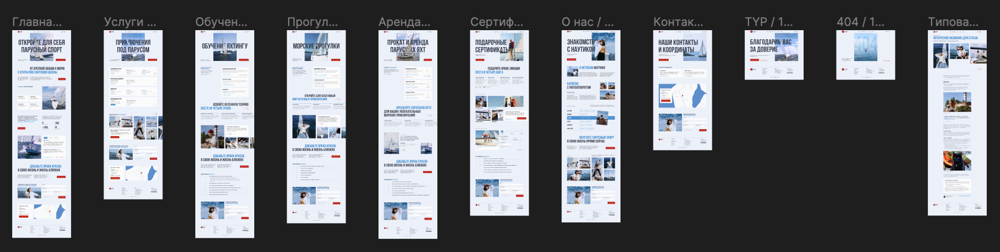

# Яхт-школа "Наутика"

### Демонстрация главной страницы сайта

### Демонстрация адаптивности страницы "Контакты"

### [Перейдите по ссылке для просмотра демо сайта](https://kaktusgr.github.io/nautika/)

## Описание

Многостраничный сайт для новосибирской яхт-школы “Наутика”.\
Сайт разработан на основе React с использованием функционального стиля и расширения JSX. Функционирование сайта обеспечено путем использования React-компонентов, хуков (useState, useRef), JavaScript-функций и событий.\
Проект адаптирован под разные размеры устройств за счет использования CSS и медиа-запросов. 

> Проект продолжает находиться в стадии разработки.

## Дизайн

Проект создан по стороннему дизайн-макету (учебному проекту другого человека) на Figma. 

Для разработки дизайнер предоставил:
- design concept;
- UI-kit;
- adaptive design.

Макет доступен для просмотра по ссылке: [https://www.figma.com/file/Nautical-school](https://www.figma.com/file/ETv7yoOmbygH92Oa0gUF2m/Nautical-school?type=design&node-id=0-1&mode=design&t=OubahxU60CIVdtpY-0).

## Запуск приложения

На вашем компьютере должен быть установлен Node.js и пакетный менеджер `npm`.

В терминале проекта вы можете запустить:

`npm start`

Запускает приложение в режиме разработки.\
Откройте [http://localhost:3000](http://localhost:3000), чтобы просмотреть его в браузере.

`npm run build`

Собирает приложение для производства в папке `build`.

## Доработки

Проект находится в стадии разработки. Ниже представлен to do list по страницам сайта:

1. Главная страница: ✅ компоненты, ✅ адаптив.
2. Страница "Услуги": ✅ компоненты, ✅ адаптив (кроме фотогалереи).
3. Страница "Обучение": ✅ компоненты (кроме фотогалереи), ❌ адаптив.
4. Страница "Прогулки": ✅ компоненты (кроме фотогалереи), ❌ адаптив.
5. Страница "Аренда": ✅ компоненты, ❌ адаптив.
6. Страница "Сертификаты": ❌ компоненты, ❌ адаптив.
7. Страница "О нас": ❌ компоненты, ❌ адаптив.
8. Страница ошибки ("Погода" намеренно отсутствует): ✅ компоненты, ✅ адаптив.
9. Страница "Контакты": ✅ компоненты, ✅ адаптив.

## Обратная связь

Приветствуются критика и комментарии. Советы и предложения будут учтены в дальнейшей разработке.